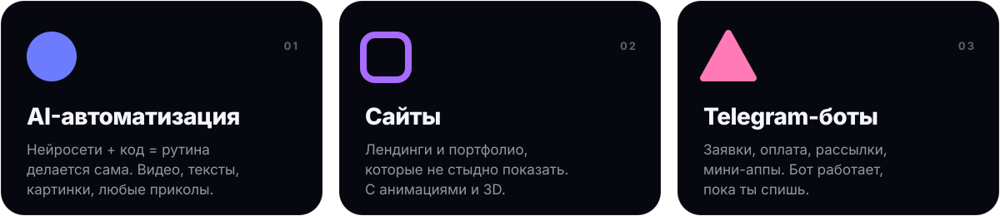

 

 

Привет, я yoo. Беру скучную задачу и прикручиваю к ней нейросети, чтобы она делалась сама. Ещё собираю сайты и Telegram-ботов под ключ.

### ● Что уже автоматизировал

- **Видео на конвейере.** Ролик собирается за 10–15 минут: сценарий, ИИ-озвучка, субтитры, анимации, рендер.
- **Вирусный монтаж.** Reels и TikTok для блогеров-миллионников, один ролик набрал 1.7M просмотров.
- **Этот профиль и [портфолио](https://github.com/yooia/portfolio)**, тоже моих рук дело.

### ■ Чем пользуюсь

### ▲ Есть идея?

Кидай в [Telegram](https://t.me/yoofake). Если это можно автоматизировать, автоматизирую.
