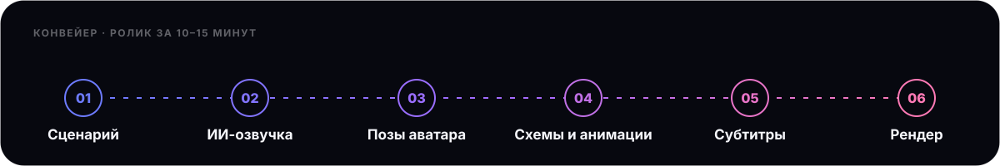

 

 

Монтирую Reels, Shorts и TikTok для блогеров-миллионников и ставлю производство на конвейер: один ролик за 10–15 минут. Отдельно делаю лендинги и Telegram-ботов под ключ.

### ▍Направления

<table>
<tr>
<td width="50%" valign="top">

**01 · Монтаж и его автоматизация** 
Вирусные вертикальные ролики: хук в первые две секунды, джамп-каты, кинетическая типографика, звук в ритм. Плюс конвейеры, которые собирают видео почти без участия человека.

</td>
<td width="50%" valign="top">

**02 · Лендинги и Telegram-боты** 
Сайты-визитки, продающие страницы и боты под ключ. Этот профиль и [портфолио](https://github.com/yorimp3/portfolio) сделаны так же.

</td>
</tr>
</table>

### ▍Как устроен конвейер

Разбираю формат на шаги и собираю пайплайн из нейросетей и кода. Дальше ролик делается сам, от простых нарезок до анимированных explainer-видео с ИИ-аватаром.

### ▍Кейсы

| Клиент | Аудитория | Результат |
|---|---|---|
| **Гоша Карцев**, ведущий, стилист, блогер | 350K Instagram · 590K YouTube · 670K TikTok | Ролик №1: **1.7M** в Instagram, 600K в TikTok Ролик №2: **1.4M** в Instagram, 550K в TikTok |
| **Дмитрий Белешко**, эксперт, блогер | 97K Instagram | «Классные работы, нравится твой стиль!» — Александра, продюсер |

> «У нас этот твой видос в инсте залетел на 1,7 м, в тиктоке на 600к, Гоша очень доволен результатом»
>  — менеджер Гоши Карцева

### ▍Инструменты

 
Нужен ролик, который досмотрят до конца? Пиши в <a href="https://t.me/yoofake">Telegram</a>.

